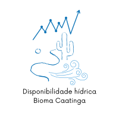

# Olá, eu sou a Fernanda
Sou uma **cientista de dados** vivendo em Maceió, Alagoas, Brasil. 
Além disso, sou _engenheira ambiental_, o que me deu bastante bastante experiência em projetos com dados na área de qualidade do ar, de energias renováveis e de produção mais limpa (P+L).
Movida pela curiosidade, gosto de explorar como a ciência e a análise de dados podem ajudar a resolver desafios em diferentes áreas.
Aqui, você encontra alguns dos meus projetos e materiais de estudo ao longo da minha jornada de aprendizado.

## Interesses
<dl>
<dt><b>📊 Dados limpos, organizados e estruturados</b></dt>
<dd>Nada como transformar um conjunto de dados bagunçado em algo útil e confiável. Ainda bem que existem Pandas, NumPy e tantas outras bibliotecas para isso!</dd>
<dt><b>🤖 A versatilidade do Machine Learning</b></dt>
<dd>As possibilidades são infinitas: desde prever tendências até entender padrões complexos. O desafio está em escolher a abordagem certa para cada problema.</dd>
<dt><b>📢 Um bom storytelling com dados</b></dt>
<dd>Como já dizia Cole Nussbaumer Knaflic em Storytelling with Data: "Há uma história em seus dados. Mas suas ferramentas não sabem qual é essa história." Tornar essas histórias compreensíveis e impactantes é essencial.</dd>
<dt><b>🌍 Análises ambientais e espaciais</b></dt>
<dd>A interseção entre dados, estatística e meio ambiente sempre me fascinou. Ferramentas como QGIS e geostatística ajudam a traduzir fenômenos ambientais em informações valiosas.</dd>
<dt><b> 🚛 Dados para tomadas de decisão estratégicas</b></dt>
<dd>Seja na otimização de processos logísticos, no varejo ou na previsão de demanda, dados bem trabalhados fazem toda a diferença. Transformar números em insights acionáveis é um desafio que me motiva.</dd>
</dl>

## Aprendizado contínuo: 
> * MBA em Data Science and Analytics (USP/ESALQ - 2024)  
> * MSc e PhD em Engenharia Hidráulica e Saneamento (USP/EESC - 2018)  
> * Doutorado Sanduíche no _Department of Engineering Science_ (Universidade de Oxford/UK - 2017)  
> * Graduação em Engenharia Ambiental e Sanitária (UFAL - 2012)

# Projetos

*Intermediário - Para quem entende do assunto:

*Avançado - Para quem é expert:

